# ◆ NEwhere — Class Diagram

> Shows how the code is organized into classes and how they interact
> Follows OOP Principles: Encapsulation, Abstraction, Inheritance, Polymorphism

---

## What is a Class Diagram?

A **class diagram** shows the blueprint of your code:
- **Classes** = templates for objects (like a blueprint for a house)
- **Attributes** = data a class stores (like house color, size)
- **Methods** = actions a class can perform (like openDoor(), lockWindow())
- **Relationships** = how classes work together

---

## Complete Class Diagram

```mermaid

---
config:
  layout: elk
---
classDiagram
    
    class EventEmitter {
        <<abstract>>
        📝 Base class for event-driven communication
        -listeners: Map~string, Function[]~
        +on(event: string, callback: Function) void
        +emit(event: string, data: any) void
        +off(event: string, callback: Function) void
    }
    note for EventEmitter "Abstract = cannot create directly,\nmust be extended by other classes.\nLike a 'template' for event handling."
    
    class BaseRepository~T~ {
        <<abstract>>
        📝 Template for database operations
        +findById(id: string) T
        +save(entity: T) void
        +delete(id: string) void
        +findAll() T[]
    }
    note for BaseRepository "Generic ~T~ = works with any type.\nLike a reusable CRUD template."
    
    class Session {
        📝 Represents one connection session
        +id: string
        +passwordHash: string
        +hostSocketId: string
        +clientSocketId: string
        +createdAt: Date
        +status: SessionStatus
        +isActive() boolean
        +toPublicDTO() SessionDTO
    }
    note for Session "Stores all info about a connection.\nNever exposes raw password,\nonly hashed version."
    
    class SessionStatus {
        <<enumeration>>
        📝 Possible session states
        WAITING
        CONNECTED
        DISCONNECTED
    }
    note for SessionStatus "Enum = fixed set of values.\nSession can only be in\none of these 3 states."
    
    class SessionDTO {
        📝 Public-safe version of Session
        +id: string
        +status: string
        +createdAt: Date
    }
    note for SessionDTO "DTO = Data Transfer Object.\nOnly includes safe data\nfor sending to clients.\nNo passwords, internal IDs, etc."
    
    class SessionRepository {
        📝 Handles saving/loading sessions from database
        -sessions: Map~string, Session~
        +findById(id: string) Session
        +save(session: Session) void
        +delete(id: string) void
        +findAll() Session[]
    }
    note for SessionRepository "Repository Pattern:\nSeparates business logic\nfrom database operations.\nEasy to swap databases later."
    
    class SessionService {
        📝 Business logic for managing sessions
        -sessionRepo: SessionRepository
        -idGenerator: IdGenerator
        +createSession(password: string) Session
        +validateSession(id: string, password: string) boolean
        +joinSession(id: string, clientSocketId: string) Session
        +endSession(id: string) void
        +getSession(id: string) Session
    }
    note for SessionService "Service = business rules.\nDecides what's allowed,\nwhen to create/delete sessions,\nvalidation logic, etc."
    
    class SignalingService {
        📝 Handles WebRTC signaling between peers
        -sessionService: SessionService
        +handleOffer(sessionId: string, offer: RTCOffer) void
        +handleAnswer(sessionId: string, answer: RTCAnswer) void
        +handleIceCandidate(sessionId: string, candidate: ICECandidate) void
        +relayToHost(sessionId: string, data: any) void
        +relayToClient(sessionId: string, data: any) void
    }
    note for SignalingService "Relays WebRTC messages\nbetween host and client\nso they can establish P2P."
    
    class IdGenerator {
        <<singleton>>
        📝 Generates unique session IDs
        -instance: IdGenerator
        +getInstance() IdGenerator
        +generate() string
    }
    note for IdGenerator "Singleton = only one instance\nexists in entire app.\nEnsures IDs are truly unique."
    
    class SessionController {
        📝 Handles session-related WebSocket messages
        -sessionService: SessionService
        -signalingService: SignalingService
        +onRegister(socket: Socket, data: RegisterPayload) void
        +onJoin(socket: Socket, data: JoinPayload) void
        +onDisconnect(socket: Socket) void
    }
    note for SessionController "Controller = entry point.\nReceives requests,\ncalls appropriate services,\nsends responses."
    
    class SignalingController {
        📝 Handles WebRTC signaling messages
        -signalingService: SignalingService
        +onOffer(socket: Socket, data: OfferPayload) void
        +onAnswer(socket: Socket, data: AnswerPayload) void
        +onIceCandidate(socket: Socket, data: ICEPayload) void
    }
    
    class WebSocketServer {
        <<singleton>>
        📝 Main server that listens for connections
        -instance: WebSocketServer
        -wss: WebSocketServerInstance
        -sessionController: SessionController
        -signalingController: SignalingController
        +getInstance() WebSocketServer
        +start(port: number) void
        +broadcast(event: string, data: any) void
    }
    note for WebSocketServer "Entry point of server app.\nListens on a port,\nroutes messages to controllers."
    
    class ScreenCapturer {
        <<interface>>
        📝 Contract for screen capture implementations
        +capture() Promise~Buffer~
        +getResolution() Resolution
    }
    note for ScreenCapturer "Interface = contract.\nAll screen capturers must\nimplement these methods,\nbut each OS does it differently."
    
    class LinuxScreenCapturer {
        📝 Linux-specific screen capture
        -display: string
        +capture() Promise~Buffer~
        +getResolution() Resolution
    }
    note for LinuxScreenCapturer "Uses X11 or Wayland APIs\nto capture Linux desktop."
    
    class MacScreenCapturer {
        📝 macOS-specific screen capture
        +capture() Promise~Buffer~
        +getResolution() Resolution
    }
    note for MacScreenCapturer "Uses macOS Core Graphics\nAPIs to capture screen."
    
    class WindowsScreenCapturer {
        📝 Windows-specific screen capture
        +capture() Promise~Buffer~
        +getResolution() Resolution
    }
    note for WindowsScreenCapturer "Uses Windows GDI or DXGI\nAPIs to capture screen."
    
    class ScreenCapturerFactory {
        <<static>>
        📝 Creates correct capturer based on OS
        +create(platform: string) ScreenCapturer
    }
    note for ScreenCapturerFactory "Factory Pattern:\nDecides which capturer to create\nbased on OS (Linux/Mac/Windows).\nHost Agent doesn't need to know."
    
    class InputSimulator {
        <<interface>>
        📝 Contract for input simulation
        +moveMouse(x: number, y: number) void
        +click(button: MouseButton) void
        +keyPress(key: string) void
        +keyRelease(key: string) void
    }
    note for InputSimulator "Interface for simulating\nmouse and keyboard.\nEach OS implements differently."
    
    class NutJsInputSimulator {
        📝 Cross-platform input simulator using nut.js
        -nut: NutJs
        +moveMouse(x: number, y: number) void
        +click(button: MouseButton) void
        +keyPress(key: string) void
        +keyRelease(key: string) void
    }
    note for NutJsInputSimulator "Uses nut.js library which\nhandles OS differences internally.\nWorks on Linux/Mac/Windows."
    
    class HostAgent {
        📝 Main host application (runs on machine to be accessed)
        -sessionId: string
        -password: string
        -capturer: ScreenCapturer
        -inputSim: InputSimulator
        -peerConnection: PeerConnection
        -signalingClient: SignalingClient
        +start() Promise~void~
        +stop() void
        +onClientConnected() void
        +onInputReceived(event: InputEvent) void
        -startStreaming() void
    }
    note for HostAgent "Main orchestrator on host machine.\nUses capturer to grab screen,\nuses inputSim to control mouse/keyboard,\nuses peerConnection for WebRTC."
    
    class PeerConnection {
        📝 Manages WebRTC peer-to-peer connection
        -pc: RTCPeerConnection
        -dataChannel: RTCDataChannel
        +createOffer() Promise~RTCOffer~
        +createAnswer(offer: RTCOffer) Promise~RTCAnswer~
        +addIceCandidate(candidate: ICECandidate) void
        +sendData(data: any) void
        +onData(callback: Function) void
        +addVideoTrack(track: MediaStreamTrack) void
        +onTrack(callback: Function) void
        +close() void
    }
    note for PeerConnection "Wraps WebRTC complexity.\nHandles video streaming\nand data channel for inputs."
    
    class SignalingClient {
        📝 Connects to signaling server via WebSocket
        -ws: WebSocket
        -serverUrl: string
        +connect() Promise~void~
        +register(password: string) Promise~string~
        +join(sessionId: string, password: string) Promise~void~
        +sendOffer(offer: RTCOffer) void
        +sendAnswer(answer: RTCAnswer) void
        +sendIceCandidate(candidate: ICECandidate) void
        +onOffer(callback: Function) void
        +onAnswer(callback: Function) void
        +onIceCandidate(callback: Function) void
    }
    note for SignalingClient "Talks to server to exchange\nWebRTC connection details.\nEvent-based communication."
    
    class ClientApp {
        📝 Main client application (Electron app user opens)
        -peerConnection: PeerConnection
        -signalingClient: SignalingClient
        -inputCapture: InputCapture
        +connect(sessionId: string, password: string) Promise~void~
        +disconnect() void
        +onFrame(callback: Function) void
    }
    note for ClientApp "Main app remote user opens.\nConnects to host,\ndisplays video stream,\nsends input events."
    
    class InputCapture {
        📝 Captures user's mouse and keyboard input
        +captureMouseMove(callback: Function) void
        +captureClick(callback: Function) void
        +captureKeyboard(callback: Function) void
        +stop() void
    }
    note for InputCapture "Listens to mouse/keyboard\non client side and converts\nto events to send to host."
    EventEmitter <|-- SignalingClient : extends
    EventEmitter <|-- PeerConnection : extends
    BaseRepository~T~ <|-- SessionRepository : extends
    ScreenCapturer <|.. LinuxScreenCapturer : implements
    ScreenCapturer <|.. MacScreenCapturer : implements
    ScreenCapturer <|.. WindowsScreenCapturer : implements
    InputSimulator <|.. NutJsInputSimulator : implements
    SessionService *-- SessionRepository : owns
    SessionService *-- IdGenerator : owns
    SignalingService *-- SessionService : owns
    SessionController *-- SessionService : owns
    SessionController *-- SignalingService : owns
    SignalingController *-- SignalingService : owns
    WebSocketServer *-- SessionController : owns
    WebSocketServer *-- SignalingController : owns
    
    HostAgent *-- ScreenCapturer : owns
    HostAgent *-- InputSimulator : owns
    HostAgent *-- PeerConnection : owns
    HostAgent *-- SignalingClient : owns
    
    ClientApp *-- PeerConnection : owns
    ClientApp *-- SignalingClient : owns
    ClientApp *-- InputCapture : owns
    Session --> SessionStatus : has
    Session ..> SessionDTO : creates
    ScreenCapturerFactory ..> ScreenCapturer : creates

```



---

## OOP Principles Explained

### 1. Encapsulation
**Definition:** Hide internal details, expose only what's necessary.

**In NEwhere:**
- `Session` class never exposes raw `password` — only `passwordHash`
- Private fields (marked with `-`) cannot be accessed directly from outside
- Example: `SessionRepository` hides how data is stored (could be database, file, memory)

```typescript
// Good - Encapsulated
class Session {
  private password: string;  // Cannot access from outside
  
  public validatePassword(input: string): boolean {
    return hash(input) === this.password;
  }
}

// Bad - Not encapsulated
class Session {
  public password: string;  // Anyone can read/modify
}
```

---

### 2. Abstraction
**Definition:** Focus on WHAT an object does, not HOW it does it.

**In NEwhere:**
- `ScreenCapturer` interface defines WHAT (capture screen, get resolution)
- Each OS-specific class defines HOW (Linux uses X11, Mac uses Core Graphics, etc.)
- `HostAgent` doesn't care HOW screen is captured, just calls `capturer.capture()`

```typescript
// Host Agent doesn't care about OS
class HostAgent {
  private capturer: ScreenCapturer;  // Could be Linux, Mac, or Windows
  
  async captureScreen() {
    const frame = await this.capturer.capture();  // Same call for all OS
    // ... stream frame
  }
}
```

---

### 3. Inheritance
**Definition:** Child class gets properties and methods from parent class.

**In NEwhere:**
- `SessionRepository` extends `BaseRepository<Session>`
- Gets all CRUD methods (create, read, update, delete) for free
- Only needs to implement Session-specific logic

```typescript
// Parent
abstract class BaseRepository<T> {
  abstract findById(id: string): T;
  abstract save(entity: T): void;
}

// Child inherits methods
class SessionRepository extends BaseRepository<Session> {
  findById(id: string): Session {
    // Implementation specific to sessions
  }
}
```

---

### 4. Polymorphism
**Definition:** Same interface, different behavior.

**In NEwhere:**
- `ScreenCapturerFactory.create('linux')` returns `LinuxScreenCapturer`
- `ScreenCapturerFactory.create('darwin')` returns `MacScreenCapturer`
- Both have `.capture()` method but work completely differently inside

```typescript
// Same method name, different behavior
const capturer = ScreenCapturerFactory.create(os.platform());
const frame = await capturer.capture();  // Works on any OS

// Linux: uses X11
// Mac: uses Core Graphics  
// Windows: uses GDI
```

---

## Design Patterns Used

| Pattern | Where Used | Why | Benefit |
|---|---|---|---|
| **Singleton** | `WebSocketServer`, `IdGenerator` | Only one instance should exist globally | Ensures single source of truth, prevents conflicts |
| **Strategy** | `ScreenCapturer`, `InputSimulator` | Different OS needs different implementations | Easy to add new OS support without changing existing code |
| **Factory** | `ScreenCapturerFactory` | Creates correct implementation based on runtime condition (OS) | Centralizes object creation logic, easy to maintain |
| **Observer** | `EventEmitter` | Components need to react to events without tight coupling | Decouples sender from receivers, easy to add new listeners |
| **Repository** | `SessionRepository` | Separates data access from business logic | Easy to swap database (SQL → NoSQL → In-Memory) without changing business code |
| **DTO** | `SessionDTO` | Never expose internal models to external consumers | Security (no sensitive data leaked), API stability |

---

## Layer Architecture (Clean Code)

```
┌─────────────────────────────────────────────────────────┐
│                    CONTROLLER LAYER                     │
│  (Receives requests, calls services, returns responses) │
│     SessionController, SignalingController              │
└─────────────────────────────────────────────────────────┘
                         ↓ uses
┌─────────────────────────────────────────────────────────┐
│                     SERVICE LAYER                       │
│     (Business logic, validation, orchestration)         │
│       SessionService, SignalingService                  │
└─────────────────────────────────────────────────────────┘
                         ↓ uses
┌─────────────────────────────────────────────────────────┐
│                   REPOSITORY LAYER                      │
│          (Database operations, data access)             │
│              SessionRepository                          │
└─────────────────────────────────────────────────────────┘
                         ↓ uses
┌─────────────────────────────────────────────────────────┐
│                      DATA LAYER                         │
│              (Database, files, storage)                 │
│                PostgreSQL / SQLite                      │
└─────────────────────────────────────────────────────────┘
```

**Why this structure?**
- Each layer has ONE responsibility
- Easy to test each layer independently
- Can change database without touching business logic
- Can add new API endpoints without touching database code

---

## Key Relationships Explained

| Relationship | Symbol | Meaning | Example |
|---|---|---|---|
| **Inheritance** | `<\|--` | IS-A | `SessionRepository` IS-A `BaseRepository` |
| **Implementation** | `<\|..` | REALIZES | `LinuxScreenCapturer` REALIZES `ScreenCapturer` interface |
| **Composition** | `*--` | OWNS (strong) | `HostAgent` OWNS `ScreenCapturer` (if agent dies, capturer dies) |
| **Aggregation** | `o--` | HAS-A (weak) | Not used in NEwhere |
| **Association** | `-->` | USES | `Session` USES `SessionStatus` |
| **Dependency** | `..>` | DEPENDS ON | `Factory` DEPENDS ON `ScreenCapturer` to create instances |

---

## Technical Terms Glossary

| Term | Simple Explanation | Technical Definition |
|---|---|---|
| **Abstract Class** | Template that cannot be used directly, must be extended | Class that cannot be instantiated, used as base for inheritance |
| **Interface** | Contract defining what methods a class must have | Type definition specifying method signatures without implementation |
| **Generic `<T>`** | Placeholder for any type, makes class reusable | Type parameter for creating parameterized types |
| **DTO** | Safe version of data for external use | Data Transfer Object - object carrying data between processes |
| **Singleton** | Class that can only have one instance | Design pattern ensuring single instance with global access point |
| **Factory** | Class that creates other objects | Creational pattern encapsulating object instantiation logic |
| **Repository** | Class that handles database operations | Pattern abstracting data access layer from business logic |
| **Controller** | Entry point that handles requests | Component receiving input and delegating to appropriate services |
| **Service** | Class containing business logic | Layer implementing core application functionality |