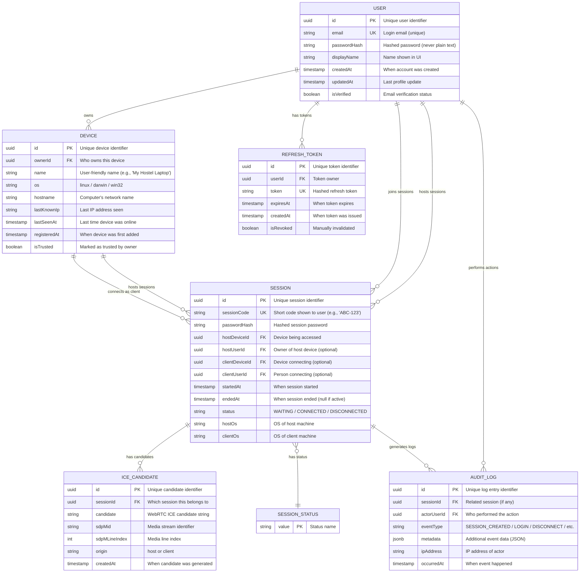

# ◆ NEwhere — ER Diagram (Database Schema)

> Entity-Relationship Diagram shows how data is stored and connected in the database
> Database: PostgreSQL (production) / SQLite (development)
> ORM: Prisma (Type-safe database access)

---

## What is an ER Diagram?

An **ER Diagram** shows:
- **Tables** = where data is stored (like Excel sheets)
- **Columns** = what information each table holds
- **Relationships** = how tables connect to each other
- **Keys** = unique identifiers (like student roll numbers)

---

## Complete ER Diagram



---

## Table Explanations

### USER Table
**Purpose:** Stores registered user accounts (optional feature — can use NEwhere without accounts)

| Column | Type | Explanation | Example |
|---|---|---|---|
| `id` | UUID | Unique identifier for this user | `550e8400-e29b-41d4-a716-446655440000` |
| `email` | String | Used for login (unique across all users) | `student@college.edu` |
| `passwordHash` | String | bcrypt hash of password (NEVER store plain password) | `$2b$10$N9qo8uLO...` |
| `displayName` | String | Name shown in UI | `John Doe` |
| `createdAt` | Timestamp | When user registered | `2024-01-15 10:30:00` |
| `isVerified` | Boolean | Whether email was verified | `true` / `false` |

**Why we need it:** To support multi-user features like saved devices, connection history, and accounts.

**Anonymous mode:** If users don't want accounts, `hostUserId` and `clientUserId` in SESSION can be null.

---

### DEVICE Table
**Purpose:** Each computer/machine running NEwhere (host or client)

| Column | Type | Explanation | Example |
|---|---|---|---|
| `id` | UUID | Unique identifier for this device | `7c9e6679-7425-40de-944b-e07fc1f90ae7` |
| `ownerId` | UUID (FK) | Which user owns this device → USER.id | `550e8400-...` |
| `name` | String | User-given nickname for device | `My Hostel Laptop` |
| `os` | String | Operating system | `linux` / `darwin` / `win32` |
| `hostname` | String | Computer's network name | `john-thinkpad` |
| `lastKnownIp` | String | Last IP address (for diagnostics) | `192.168.1.10` |
| `isTrusted` | Boolean | User marked as trusted | `true` |

**Why we need it:** Track which devices a user has connected before, enable "My Devices" feature, audit trail.

**Example scenario:** You have 3 devices — college MacBook, hostel Linux machine, home Windows PC. Each gets a row here.

---

### SESSION Table
**Purpose:** Records every connection attempt/session between a host and client

| Column | Type | Explanation | Example |
|---|---|---|---|
| `id` | UUID | Unique session identifier | `a1b2c3d4-...` |
| `sessionCode` | String | Short human-readable code | `ABC-123` |
| `passwordHash` | String | Hash of session password | `$2b$10$...` |
| `hostDeviceId` | UUID (FK) | Device being accessed → DEVICE.id | `7c9e6679-...` |
| `clientDeviceId` | UUID (FK) | Device connecting → DEVICE.id | `8d0f7780-...` |
| `startedAt` | Timestamp | When connection started | `2024-02-18 14:30:00` |
| `endedAt` | Timestamp | When connection ended (null if active) | `2024-02-18 16:45:00` or `null` |
| `status` | Enum | Current state | `WAITING` / `CONNECTED` / `DISCONNECTED` |

**Why we need it:** Track all connections, show history, calculate usage statistics, security auditing.

**Example row:**
```
id: a1b2c3d4-...
sessionCode: ABC-123
hostDeviceId: (your hostel laptop)
clientDeviceId: (your college macbook)
startedAt: 2024-02-18 14:30:00
endedAt: 2024-02-18 16:45:00
status: DISCONNECTED
```
This row says: "You connected from college to hostel laptop from 2:30 PM to 4:45 PM"

---

### SESSION_STATUS Table
**Purpose:** Enumeration of valid session states (lookup table)

| Column | Type | Explanation | Valid Values |
|---|---|---|---|
| `value` | String | Status name | `WAITING` / `CONNECTED` / `DISCONNECTED` |

**Why we need it:** Ensures sessions can only have valid statuses, acts as a constraint.

**Rows:**
```
WAITING       - Host is ready, waiting for client
CONNECTED     - Client is actively connected
DISCONNECTED  - Session has ended
```

---

### ICE_CANDIDATE Table
**Purpose:** Stores WebRTC ICE candidates during connection setup (temporary data)

| Column | Type | Explanation | Example |
|---|---|---|---|
| `id` | UUID | Unique identifier | `b2c3d4e5-...` |
| `sessionId` | UUID (FK) | Which session → SESSION.id | `a1b2c3d4-...` |
| `candidate` | String | Raw ICE candidate from WebRTC | `candidate:842163049 1 udp...` |
| `origin` | String | Who sent it | `host` or `client` |

**Why we need it:** WebRTC needs to exchange network paths (ICE candidates) to establish P2P connection. Server stores them temporarily to relay between host and client.

**Lifecycle:** Created during handshake, can be deleted after session ends (cleanup).

---

### AUDIT_LOG Table
**Purpose:** Immutable security log of all important events (never modified or deleted)

| Column | Type | Explanation | Example |
|---|---|---|---|
| `id` | UUID | Unique log entry | `c3d4e5f6-...` |
| `sessionId` | UUID (FK) | Related session (nullable) | `a1b2c3d4-...` |
| `actorUserId` | UUID (FK) | Who did it → USER.id | `550e8400-...` |
| `eventType` | String | What happened | `SESSION_CREATED` / `LOGIN_FAILED` / `DEVICE_ADDED` |
| `metadata` | JSON | Extra details | `{"deviceName": "Hostel Laptop", "ip": "192.168.1.10"}` |
| `ipAddress` | String | IP of actor | `192.168.1.10` |
| `occurredAt` | Timestamp | When it happened | `2024-02-18 14:30:00` |

**Why we need it:** Security auditing, debugging, compliance, detect suspicious activity.

**Example events:**
```
SESSION_CREATED    - New session started
LOGIN_FAILED       - Wrong password attempt
SESSION_ENDED      - Connection closed
DEVICE_REGISTERED  - New device added
PASSWORD_CHANGED   - User changed password
```

**Important:** Logs are **append-only** — never updated or deleted.

---

### REFRESH_TOKEN Table
**Purpose:** Stores JWT refresh tokens for keeping users logged in securely

| Column | Type | Explanation | Example |
|---|---|---|---|
| `id` | UUID | Unique token identifier | `d4e5f6g7-...` |
| `userId` | UUID (FK) | Token owner → USER.id | `550e8400-...` |
| `token` | String | Hashed refresh token | `$2b$10$...` |
| `expiresAt` | Timestamp | When token expires | `2024-03-18 14:30:00` (30 days later) |
| `isRevoked` | Boolean | Manually invalidated (for logout) | `false` |

**Why we need it:** Allow users to stay logged in without re-entering password every time. More secure than storing password.

**How it works:**
1. User logs in → get access token (15 min) + refresh token (30 days)
2. Access token expires → use refresh token to get new access token
3. User logs out → mark refresh token as revoked

---

## Relationships Explained

### One-to-Many Relationships (||--o{)

| Parent | Child | Meaning | Example |
|---|---|---|---|
| USER | DEVICE | One user owns many devices | You own laptop, desktop, phone |
| USER | SESSION | One user hosts many sessions | You've hosted 50 connections |
| DEVICE | SESSION | One device hosts many sessions | Your laptop has been accessed 30 times |
| SESSION | ICE_CANDIDATE | One session has many ICE candidates | Each connection tries 5-10 network paths |
| SESSION | AUDIT_LOG | One session generates many log entries | Session created → connected → disconnected = 3 logs |

### Many-to-One Relationships (}o--|)

| Child | Parent | Meaning |
|---|---|---|
| SESSION | SESSION_STATUS | Each session has exactly one status |

---

## Example Data (What actual rows look like)

### USER Table
```
┌──────────────────────────────────────┬───────────────────┬─────────────┬────────────┐
│ id                                   │ email             │ displayName │ isVerified │
├──────────────────────────────────────┼───────────────────┼─────────────┼────────────┤
│ 550e8400-e29b-41d4-a716-446655440000 │ john@college.edu  │ John Doe    │ true       │
│ 661f9511-f3ac-52e5-b827-557766551111 │ jane@hostel.in    │ Jane Smith  │ true       │
└──────────────────────────────────────┴───────────────────┴─────────────┴────────────┘
```

### DEVICE Table
```
┌──────────────────────────────────────┬──────────────────────────────────────┬──────────────────┬────────┐
│ id                                   │ ownerId                              │ name             │ os     │
├──────────────────────────────────────┼──────────────────────────────────────┼──────────────────┼────────┤
│ 7c9e6679-7425-40de-944b-e07fc1f90ae7 │ 550e8400-e29b-41d4-a716-446655440000 │ Hostel Laptop    │ linux  │
│ 8d0f7780-8536-51ef-a055-f18gd2ga1bf8 │ 550e8400-e29b-41d4-a716-446655440000 │ College MacBook  │ darwin │
└──────────────────────────────────────┴──────────────────────────────────────┴──────────────────┴────────┘
```

### SESSION Table
```
┌──────────────────────────────────────┬─────────────┬──────────────────────────────────────┬────────────┬────────────────────────┐
│ id                                   │ sessionCode │ hostDeviceId                         │ status     │ startedAt              │
├──────────────────────────────────────┼─────────────┼──────────────────────────────────────┼────────────┼────────────────────────┤
│ a1b2c3d4-1234-5678-90ab-cdef12345678 │ ABC-123     │ 7c9e6679-7425-40de-944b-e07fc1f90ae7 │ CONNECTED  │ 2024-02-18 14:30:00    │
└──────────────────────────────────────┴─────────────┴──────────────────────────────────────┴────────────┴────────────────────────┘
```

---

## Technical Terms Glossary

| Term | Simple Explanation | Technical Definition |
|---|---|---|
| **Primary Key (PK)** | Unique identifier for each row, like a student roll number | Column that uniquely identifies each record in a table |
| **Foreign Key (FK)** | Reference to another table's primary key | Column that references the primary key of another table |
| **UUID** | Universally unique 128-bit identifier | Unique identifier that's virtually impossible to duplicate |
| **Unique Key (UK)** | Column that must have unique values (no duplicates) | Constraint ensuring column values are unique across table |
| **Enum** | Fixed set of allowed values | Enumeration type limiting possible values |
| **Hash** | One-way encrypted string (cannot be reversed) | Cryptographic digest using bcrypt/scrypt |
| **JSON/JSONB** | Flexible data storage for varying structures | Binary JSON storage in PostgreSQL |
| **Timestamp** | Date + time with timezone | ISO 8601 datetime |
| **Nullable** | Column can be empty (NULL) | Allows NULL values |
| **Cascade Delete** | Deleting parent deletes children | Referential action propagating deletions |

---

## Database Design Decisions

| Decision | Reasoning |
|---|---|
| **UUID instead of auto-increment** | Distributed systems, prevents ID collision, better security (unpredictable) |
| **Separate DEVICE table** | Users may have multiple devices, need to track each independently |
| **sessionCode vs id** | Short code for users to type (ABC-123), UUID for internal use |
| **Nullable user IDs** | Support anonymous mode without accounts |
| **AUDIT_LOG is append-only** | Security, compliance, forensics — never modified or deleted |
| **ICE_CANDIDATE separate table** | Transient data, can be cleaned up after session, keeps SESSION table clean |
| **passwordHash, never password** | Security — plain passwords never stored anywhere |
| **JSONB for metadata** | Flexible event data without rigid schema, queryable in PostgreSQL |

---

## Database Indexes (For Performance)

```sql
-- Speed up lookups by email
CREATE INDEX idx_user_email ON USER(email);

-- Speed up finding sessions by code
CREATE INDEX idx_session_code ON SESSION(sessionCode);

-- Speed up finding user's devices
CREATE INDEX idx_device_owner ON DEVICE(ownerId);

-- Speed up finding active sessions
CREATE INDEX idx_session_status ON SESSION(status);

-- Speed up audit log queries by user
CREATE INDEX idx_audit_user ON AUDIT_LOG(actorUserId);
```

---

## Notes

- **Development:** Use SQLite for easy setup (single file database)
- **Production:** Use PostgreSQL for better performance and features
- **Migrations:** Prisma handles schema changes automatically
- **Seeding:** Create test users/devices for development
- **Backup:** Regular backups of production database
- **Privacy:** GDPR-compliant — users can request data deletion