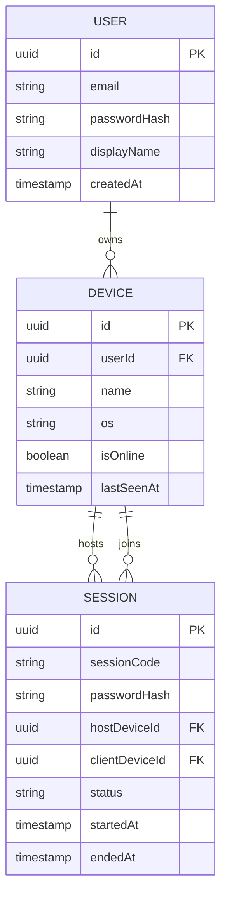

# NEwhere — Data & Storage

---

## Phase 1 — No database at all

In Phase 1, there's no database. Sessions just live in the server's memory while it's running. The moment the server restarts they're gone — and that's totally fine because sessions are short-lived anyway. You connect, do your work, disconnect. Done.

Think of it like a whiteboard. You write the session on it while it's active, wipe it off when it ends.

```typescript
// This is all the server holds in memory — just a Map
const sessions = new Map<string, Session>()

// What one session looks like
interface Session {
  id: string            // e.g. "V1StGXR8"
  sessionCode: string   // e.g. "ABC-123" — what the user types
  passwordHash: string  // the password, hashed — never plain text
  hostSocketId: string  // which WebSocket connection is the host
  clientSocketId: string | null  // which one is the client (empty until someone joins)
  status: 'WAITING' | 'CONNECTED' | 'DISCONNECTED'
  createdAt: Date
}
```

ICE candidates (the little network messages WebRTC needs to connect two machines) are also never stored. They come in, get forwarded to the other side immediately, and are forgotten. No reason to save them.

---

## Phase 7 — Database (only when we add user accounts)

The only reason we bring in a database is when we want users to:
- Log in and have an account
- See their saved devices ("My Hostel Laptop", "Home PC")
- See connection history

For that we need just **3 tables**. That's it.

---

## The 3 tables


```mermaid
erDiagram

    USER {
        uuid id PK
        string email
        string passwordHash
        string displayName
        timestamp createdAt
    }

    DEVICE {
        uuid id PK
        uuid userId FK
        string name
        string os
        boolean isOnline
        timestamp lastSeenAt
    }

    SESSION {
        uuid id PK
        string sessionCode
        string passwordHash
        uuid hostDeviceId FK
        uuid clientDeviceId FK
        string status
        timestamp startedAt
        timestamp endedAt
    }

    USER ||--o{ DEVICE : "owns"
    DEVICE ||--o{ SESSION : "hosts"
    DEVICE ||--o{ SESSION : "joins"
```

---

## What each table is for

**USER** — a person with an account. Email and a hashed password. Simple.

**DEVICE** — one of their machines. A user can have many devices (hostel laptop, home PC, college Mac). Each device gets a row. We track which OS it runs and whether it's currently online.

**SESSION** — one connection event. Which device was the host, which was the client, when it started, when it ended, what the status was.

---

## Why only 3 tables and not more?

Because that's genuinely all we need. The AI-generated version had tables for audit logs, refresh tokens, ICE candidates, session status lookups — none of that is needed to make this work. We'll add more only if a real need shows up.

---

## Quick rules we follow

- Passwords are **never stored plain** — always hashed with bcrypt before touching the DB
- ICE candidates are **never stored** — relayed live over WebSocket and forgotten
- `sessionCode` (like `ABC-123`) is separate from the internal `id` (UUID) — one is for humans to type, one is for the system to use internally
- `clientDeviceId` is nullable — a session starts with just the host, client fills in later when someone joins