# ◆ NEwhere — Sequence Diagram

> Complete flow: Host starts → Remote user connects → Connection established → Screen streams → Inputs forwarded → Session ends

---

## Main Connection Flow

```mermaid
sequenceDiagram
    autonumber
    
    participant HU as Host User<br/>(at hostel)
    participant HA as Host Agent<br/>(software on host machine)
    participant Server as NEwhere Server<br/>(cloud)
    participant Client as Client App<br/>(software on remote machine)
    participant RU as Remote User<br/>(at college)
    
    %% ═══════════════════════════════════════════════
    %% PHASE 1: HOST STARTS AND REGISTERS
    %% ═══════════════════════════════════════════════
    rect rgb(230, 245, 255)
        Note over HU,HA: Phase 1: Host Starts and Registers
        
        HU->>HA: 1. Start NEwhere Host Agent
        activate HA
        Note right of HA: Host agent starts running<br/>on the machine to be accessed
        
        HA->>Server: 2. Connect via WebSocket
        activate Server
        Server-->>HA: 3. Connection Accepted
        Note right of Server: Server is now aware<br/>of this host machine
        
        HA->>Server: 4. Register Host<br/>(send machine info: OS, hostname)
        Server->>Server: 5. Generate Session ID<br/>(e.g., "ABC-123")
        Note right of Server: Creates unique ID<br/>for this session
        
        Server-->>HA: 6. Return Session ID + Token
        HA->>HA: 7. Display Session ID on screen
        HA-->>HU: 8. Shows: "Your Session ID: ABC-123"
        Note right of HU: Host user can now<br/>share this ID with<br/>the remote user
        deactivate HA
    end
    
    %% ═══════════════════════════════════════════════
    %% PHASE 2: REMOTE USER CONNECTS
    %% ═══════════════════════════════════════════════
    rect rgb(255, 245, 230)
        Note over RU,Client: Phase 2: Remote User Connects
        
        RU->>Client: 9. Open NEwhere Client App
        activate Client
        RU->>Client: 10. Enter Session ID "ABC-123"
        RU->>Client: 11. Enter Password
        
        Client->>Server: 12. Connect via WebSocket
        Server-->>Client: 13. Connection Accepted
        
        Client->>Server: 14. Request to Join Session<br/>(sessionId: "ABC-123", password)
        activate Server
        
        Server->>Server: 15. Validate Session<br/>(check if ID exists)
        Server->>Server: 16. Validate Password<br/>(compare hash)
        
        alt Password Correct
            Server-->>Client: 17. Authentication Success<br/>(host info returned)
            Server->>HA: 18. Notify Host: "Client wants to connect"
            activate HA
            Note right of HA: Host is informed<br/>someone is connecting
        else Password Wrong
            Server-->>Client: Authentication Failed
            Note right of Client: Connection rejected,<br/>user must retry
        end
        deactivate Server
    end
    
    %% ═══════════════════════════════════════════════
    %% PHASE 3: WEBRTC PEER-TO-PEER SETUP
    %% ═══════════════════════════════════════════════
    rect rgb(230, 255, 238)
        Note over HA,Client: Phase 3: WebRTC Handshake (Direct Connection Setup)
        Note over HA,Client: Server acts as messenger to help them find each other
        
        HA->>HA: 19. Create WebRTC Connection Object
        Note right of HA: Prepares to establish<br/>direct connection
        
        HA->>HA: 20. Generate SDP Offer<br/>(connection details)
        Note right of HA: SDP = description of<br/>what host can send/receive
        
        HA->>Server: 21. Send SDP Offer to Server
        Server->>Client: 22. Forward SDP Offer to Client
        
        Client->>Client: 23. Create WebRTC Connection Object
        Client->>Client: 24. Process SDP Offer
        Client->>Client: 25. Generate SDP Answer<br/>(client's connection details)
        
        Client->>Server: 26. Send SDP Answer to Server
        Server->>HA: 27. Forward SDP Answer to Host
        
        HA->>HA: 28. Process SDP Answer
        Note right of HA: Both sides now know<br/>each other's capabilities
        
        %% ICE Candidate Exchange
        loop ICE Candidate Exchange (finding best path)
            Note over HA,Client: Both machines try different network paths<br/>to find the fastest direct route
            
            HA->>Server: 29. Send ICE Candidate<br/>(possible network path)
            Server->>Client: 30. Forward ICE Candidate
            
            Client->>Server: 31. Send ICE Candidate
            Server->>HA: 32. Forward ICE Candidate
        end
        
        Note over HA,Client: Direct Peer-to-Peer Connection Established ✓
        HA-->>Client: 33. P2P Connection Active
        Note over HA,Client: Server no longer needed for data transfer<br/>Everything now flows directly between machines
        
        deactivate HA
        deactivate Client
    end
    
    %% ═══════════════════════════════════════════════
    %% PHASE 4: SCREEN STREAMING
    %% ═══════════════════════════════════════════════
    rect rgb(255, 230, 255)
        Note over HA,Client: Phase 4: Live Screen Streaming
        
        activate HA
        activate Client
        
        HA->>HA: 34. Start Screen Capture
        Note right of HA: Continuously captures<br/>what's on the screen
        
        loop Every 16ms (60 FPS)
            HA->>HA: 35. Capture Screen Frame
            HA->>HA: 36. Encode Frame<br/>(compress to reduce size)
            Note right of HA: Converts raw pixels to<br/>efficient video format
            
            HA->>Client: 37. Stream Video Frame<br/>(via WebRTC direct connection)
            Client->>Client: 38. Decode Frame<br/>(decompress)
            Client->>Client: 39. Display Frame on Screen
            Client-->>RU: 40. Remote User Sees Live Screen
        end
        
        Note right of RU: User now sees the host<br/>machine's screen in real-time
    end
    
    %% ═══════════════════════════════════════════════
    %% PHASE 5: INPUT FORWARDING
    %% ═══════════════════════════════════════════════
    rect rgb(255, 255, 220)
        Note over RU,HA: Phase 5: Input Control (Mouse & Keyboard)
        
        RU->>Client: 41. Move Mouse / Click / Type
        Note right of RU: User interacts with<br/>the displayed screen
        
        Client->>Client: 42. Capture Input Event<br/>(record what user did)
        
        Client->>HA: 43. Send Input Event<br/>via WebRTC Data Channel<br/>(type: "mousemove", x: 500, y: 300)
        Note right of Client: Data Channel = separate<br/>direct connection for<br/>control commands
        
        HA->>HA: 44. Receive Input Event
        HA->>HA: 45. Simulate Input on Host Machine<br/>(actually move mouse / click / type)
        Note right of HA: Uses system APIs to<br/>perform the action as if<br/>someone physically did it
        
        HA-->>RU: 46. Action Reflects in Screen Stream
        Note right of RU: User sees their action<br/>happen on the remote screen
        
        deactivate HA
        deactivate Client
    end
    
    %% ═══════════════════════════════════════════════
    %% PHASE 6: DISCONNECTION
    %% ═══════════════════════════════════════════════
    rect rgb(240, 240, 240)
        Note over RU,Server: Phase 6: Session Ends
        
        activate Client
        activate HA
        
        RU->>Client: 47. Click "Disconnect"
        
        Client->>HA: 48. Close WebRTC Connection<br/>(stop video & data channels)
        Client->>Server: 49. Notify Server: Session Ended
        
        Server->>HA: 50. Notify Host: Client Disconnected
        
        HA->>HA: 51. Stop Screen Capture
        HA->>HA: 52. Clean Up Resources
        
        HA-->>HU: 53. Display: "Session Ended"<br/>Ready for New Connection
        Note right of HU: Host can now accept<br/>another connection with<br/>the same or new session ID
        
        deactivate Client
        deactivate HA
    end
```



---

## Simplified Text Flow

```
┌─────────────────────────────────────────────────────────────────┐
│ STEP 1: HOST PREPARES                                           │
│ Host User → Starts Host Agent → Connects to Server              │
│ Server → Generates Session ID "ABC-123" → Sends to Host         │
│ Host → Displays ID on screen                                    │
└─────────────────────────────────────────────────────────────────┘

┌─────────────────────────────────────────────────────────────────┐
│ STEP 2: REMOTE USER JOINS                                       │
│ Remote User → Opens Client → Enters "ABC-123" + Password        │
│ Client → Sends to Server → Server Validates → Tells Host        │
└─────────────────────────────────────────────────────────────────┘

┌─────────────────────────────────────────────────────────────────┐
│ STEP 3: DIRECT CONNECTION (via Server as messenger)             │
│ Host ← → Server ← → Client (exchange connection details)        │
│ Both try different network paths (ICE candidates)               │
│ ═══════ Direct P2P Connection Established ═══════              │
│ Server is no longer involved in data transfer                   │
└─────────────────────────────────────────────────────────────────┘

┌─────────────────────────────────────────────────────────────────┐
│ STEP 4: SCREEN STREAMING (Host → Client directly)               │
│ Host captures screen → encodes → streams → Client decodes       │
│ Remote User sees live screen (60 times per second)              │
└─────────────────────────────────────────────────────────────────┘

┌─────────────────────────────────────────────────────────────────┐
│ STEP 5: INPUT CONTROL (Client → Host directly)                  │
│ Remote User moves mouse/types → Client captures event           │
│ → Sends to Host → Host simulates on actual machine              │
│ Action appears in screen stream                                 │
└─────────────────────────────────────────────────────────────────┘

┌─────────────────────────────────────────────────────────────────┐
│ STEP 6: DISCONNECT                                              │
│ Remote User clicks disconnect → Connections closed              │
│ Host returns to waiting for new connections                     │
└─────────────────────────────────────────────────────────────────┘
```

---

## Key Technical Terms Explained

| Term | Simple Explanation | Industry Standard Meaning |
|---|---|---|
| **WebSocket** | A persistent two-way communication channel between machines | Full-duplex communication protocol over TCP |
| **Session ID** | A unique code (like "ABC-123") that identifies this connection | Unique identifier for a user session |
| **WebRTC** | Technology for direct peer-to-peer video/data streaming | Web Real-Time Communication - browser standard for P2P |
| **SDP Offer/Answer** | Messages describing what each machine can send/receive | Session Description Protocol - negotiation format |
| **ICE Candidate** | A possible network path between two machines | Interactive Connectivity Establishment - NAT traversal method |
| **P2P (Peer-to-Peer)** | Direct connection between two machines (no middleman) | Distributed architecture where peers communicate directly |
| **Data Channel** | Separate direct connection for sending control commands | WebRTC data channel - for arbitrary data transfer |
| **Frame** | One complete image of the screen (like one photo) | Single complete image in a video sequence |
| **Encode/Decode** | Compress/decompress video to save bandwidth | Video codec operation |
| **60 FPS** | 60 frames (images) sent per second = smooth video | Frames Per Second - video refresh rate |

---

## Why This Architecture?

| Design Decision | Reason |
|---|---|
| **Server only for handshake** | After P2P is established, data flows directly between machines - faster and more private |
| **WebRTC for streaming** | Industry standard, handles NAT traversal automatically, built-in encryption |
| **Separate Data Channel for inputs** | Text commands (mouse/keyboard) sent separately from video stream for lower latency |
| **Password hashed** | Never stored or sent in plain text - only the hash is compared |
| **Direct P2P connection** | No data passes through server after connection = better privacy + lower latency |

---

## What Happens If...?

| Scenario | Result |
|---|---|
| **Password is wrong** | Server rejects connection at step 17, client cannot proceed |
| **Host closes agent** | Active connections are terminated, session ID becomes invalid |
| **Internet drops on one side** | WebRTC detects disconnect, both sides clean up, session ends |
| **Server goes down** | New connections cannot start, but existing P2P connections continue working |
| **Multiple people try same Session ID** | Only the first person with correct password connects (or server can allow multiple - design choice) |