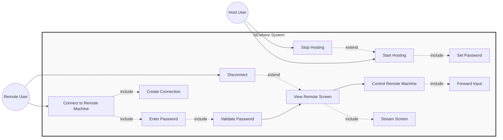

# ◆ NEwhere — Use Case Diagram

---

## Actors

| Actor | Description |
|---|---|
| **Remote User** | Person connecting to access a remote machine |
| **Host User** | Person who owns the machine being accessed |

---

## Use Case Diagram

---

## Use Case Descriptions

### Remote User Use Cases

#### UC-01: Connect to Remote Machine
- **Actor:** Remote User
- **Description:** User opens NEwhere and enters the session ID to connect
- **Precondition:** Host is running and has shared session ID
- **Includes:** 
  - UC-02 (Enter Password) - must provide password
  - UC-09 (Validate Password) - system checks password
  - UC-10 (Create Connection) - establishes WebRTC connection
- **Postcondition:** Connected to remote machine

#### UC-02: Enter Password
- **Description:** User types the password set by host
- **Included by:** UC-01
- **Postcondition:** Password submitted for validation

#### UC-03: View Remote Screen
- **Actor:** Remote User
- **Description:** See live video stream of the remote desktop
- **Precondition:** Successfully connected
- **Includes:** UC-11 (Stream Screen) - system continuously streams
- **Extended by:** UC-05 (Disconnect) - user can choose to disconnect
- **Postcondition:** Remote screen visible in real-time

#### UC-04: Control Remote Machine
- **Actor:** Remote User
- **Description:** Use keyboard and mouse to control the remote machine
- **Precondition:** Viewing remote screen
- **Includes:** UC-12 (Forward Input) - system sends inputs to host
- **Postcondition:** Actions executed on remote machine

#### UC-05: Disconnect
- **Actor:** Remote User
- **Description:** User ends the session and closes connection
- **Extends:** UC-03 (View Remote Screen) - optional action
- **Postcondition:** Connection terminated

---

### Host User Use Cases

#### UC-06: Start Hosting
- **Actor:** Host User
- **Description:** Start the NEwhere host agent to allow remote connections
- **Precondition:** NEwhere installed
- **Includes:** UC-07 (Set Password) - must set password
- **Extended by:** UC-08 (Stop Hosting) - can stop anytime
- **Postcondition:** Session ID generated, ready to accept connections

#### UC-07: Set Password
- **Description:** Host sets a password to protect the session
- **Included by:** UC-06
- **Postcondition:** Password saved securely

#### UC-08: Stop Hosting
- **Actor:** Host User
- **Description:** Host stops accepting connections and ends current session
- **Extends:** UC-06 (Start Hosting) - optional action
- **Postcondition:** No longer accepting connections

---

### System Use Cases

#### UC-09: Validate Password
- **Description:** System checks if the password entered by remote user matches
- **Included by:** UC-02
- **Postcondition:** Access granted or denied

#### UC-10: Create Connection
- **Description:** System establishes WebRTC peer-to-peer connection
- **Included by:** UC-01
- **Postcondition:** Direct connection between machines established

#### UC-11: Stream Screen
- **Description:** System captures host screen and streams it to remote user
- **Included by:** UC-03
- **Postcondition:** Video stream active

#### UC-12: Forward Input
- **Description:** System sends keyboard/mouse events from remote to host
- **Included by:** UC-04
- **Postcondition:** Input executed on host machine

---

## Relationship Explanation

### Include (mandatory, always happens)
| Base Use Case | Includes | Why |
|---|---|---|
| Connect to Remote Machine | Enter Password | Can't connect without password |
| Connect to Remote Machine | Validate Password | Password must be checked |
| Connect to Remote Machine | Create Connection | Connection must be established |
| View Remote Screen | Stream Screen | Must stream to view |
| Control Remote Machine | Forward Input | Must forward to control |
| Start Hosting | Set Password | Must set password to host |

### Extend (optional, might happen)
| Extension Use Case | Extends | Why |
|---|---|---|
| Disconnect | View Remote Screen | User can disconnect anytime (optional) |
| Stop Hosting | Start Hosting | Host can stop anytime (optional) |